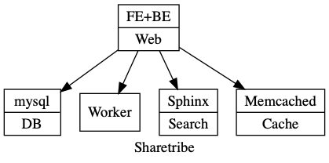
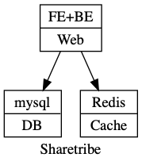

# Deployment as Containers #

Based on initial understanding of the readme the sharetribe deployment will have the following components



## Steps ##

1. Clone and checkout to latest release version

	``` sh
	git clone https://github.com/sharetribe/sharetribe.git
	cd sharetribe
	git checkout v9.1.0
	```

2. Running the docker build fails with the following errror

	> ERROR: Service 'web' failed to build: The command '/bin/sh -c script/prepare-assets.sh' returned a non-zero code: 1
	
	So, create an empty assets.tar.gz to avoid it

	``` sh
	mkdir t ; cd t ; tar czf ../assets.tar.gz . ; cd .. ; rm -fr t
	```

3. The docker build ignores `config/database.yml` so, include that to the Dockerfile and parameterize it so that the values to connect to the database are picked up from the environment

	``` dockerfile
	# add enviroment config
	RUN sed -E \
		-e 's/# ADD DATABASE USERNAME/<%= ENV["DB_USER"] %>/' \
		-e 's/# ADD DATABASE PASSWORD/<%= ENV["DB_PASSWORD"] %>/' \
		-e 's/sharetribe_.*$/<%= ENV["DB_NAME"] %>/' \
		-e 's/localhost$/<%= ENV["DB_HOST"] %>/' \
		config/database.example.yml > config/database.yml
	```

4. Same for the `config/config.yml` to pick up credentials for S3. There seems to be a way to configure local but, it doesn't reveal itself :/. `secret_key_base` is also expected but, for some reason not part of the default configuration

	``` dockerfile
	ADD/config.yml config/config.yml
	```

	Contents of [`config.yml`](config.yml)

	``` yaml
    secret_key_base: <%= ENV['SECRET_KEY_BASE'] %>
    active_storage.service: local
    amazon:
      service: S3
      access_key_id: <%= ENV['AWS_ACCESS_KEY_ID'] %>
      secret_access_key: <%= ENV['AWS_SECRET_ACCESS_KEY'] %>
      region: <%= ENV['AWS_DEFAULT_REGION'] %>
      bucket: <%= ENV['SHARETRIBE_BUCKET'] %>
	```

5. MySQL client is also required to run the database migrations :|

	``` dockerfile
	RUN apt-get install -y mysql-client
	```

6. Now, finally build the container

	``` sh
	docker-compose build
	```

7. Create a network

	``` sh
	docker network create sharetribe
	```

8. Fire up the containers

	``` sh
	docker-compose up -d
	```
	
	Current deployment looks like the following
	
	

9. Populate the database and restart the web container

	``` sh
	# load data
	docker-compose exec web bundle exec rake db:structure:load

	# restart
	docker-compose restart web
	```

10. Application should hopefully be running on port `3000`

	```sh
	open "http://`docker-machine ip default`:3000"
	```

11. Start the worker processs

	``` sh
	docker-compose exec web bundle exec rake jobs:work
	```

11. Fix **vendor-bundle** errors by running the asset precompilation

	``` sh
	docker-compose exec web bundle exec rake assets:precompile
	```

12. **TODO** Fix sphinxsearch installation so, as an intermediate step install and start sphinxsearch

	**NOTE** Ensure that the `SPHINX_HOST` is set to localhost in the `web.env`

	``` sh
	docker-compose exec --user=root -T web apt-get install -y sphinxsearch
	docker-compose exec -T web bundle exec rake ts:index ts:configure ts:start
	```


### Links ###

- [Deploying on Amazon AWS (Free-Tier) with EC2, RDS & S3](https://gist.github.com/pcm211/10950bf5447a51fdcd1c)
- [Deploying Sharetribe to Heroku](https://gist.github.com/svallory/d08e9baa88e18d691605)
- [How to deploy FTW to production](https://www.sharetribe.com/docs/ftw-hosting/how-to-deploy-ftw-to-production/)
